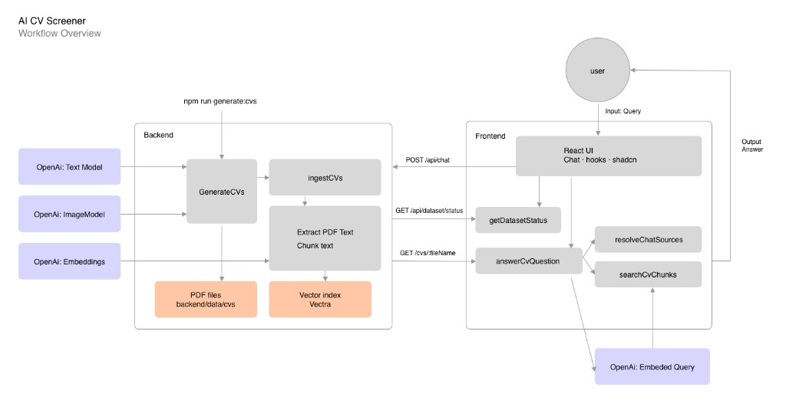

# CV Screener

Monorepo with a React frontend (chat over CVs) and an Express backend with Hexagonal Arquitecture.

**Backend:** Node.js, TypeScript, Express, OpenAI SDK, Vectra (local vector store), PDFKit / pdf.js for generation and ingest.

**Frontend:** React + Vite; axios client with a response interceptor for API errors; chat UI with loading, errors, source badges, and dataset-aware empty state.

**Quality:** Unit tests (backend + frontend), Playwright e2e (mocked API), GitHub Actions CI, Husky (lint-staged + pre-push unit tests).


## Frontend

```
modules/chat/
  model/           ChatMessage, createMessage
  application/     outgoing message rules, thread key, scroll metrics
  infrastructure/  apiClient (axios), chatClient, datasetClient, cvDownloadUrl
components/
  Chat.tsx         composer, message list, empty states
  layout/          AppLayout, AppHeader, AppFooter
  shadcn/          shadcn/ui primitives (button, badge, textarea, …)
  ui/              app-facing re-exports (Button, Badge, …)
  ui/chat/         ChatBubble, ChatTextarea, ChatMessageContent, ChatEmptyNoDataset, …
hooks/             useChat, useChatScroll, useTheme, useDatasetStatus
constants/         prompt suggestions, generate-cvs command copy
utils/             string (lists, PDF names), date (message timestamps)
styles/            global.css, layout.css
index.css          Tailwind v4 + shadcn theme tokens (light / `.dark`)
```

## Backend

```
domain/agents/   LLM agent definitions (prompts, temperature, buildUserMessage)
application/     generateCv, ingestCvs, searchCvChunks, answerCvQuestion, getDatasetStatus
infrastructure/  openAi/runAgents (runChatAgent, runImageAgent), PDF, Vectra
composition/     Express app wiring
scripts/         generateCvs, ingestCvs CLIs
api/             HTTP routes (`POST /chat`, `GET /dataset/status`, `GET /cvs/:fileName`)
```

## Workflow overview



## Demo

**[AI Powered CV Screener — technical demo](https://www.loom.com/share/699c47f1ddd94286bd7912913d42f2f3)** (Loom)

## CV generation and ingest

```bash
npm run generate:cvs -- 25
```

```bash
npm run ingest:cvs
```


### Pipeline

1. **Blueprint** — random role, language, seniority, industry  
   `createRandomCvBlueprint()` in `domain/cvBlueprint.ts`

2. **Text** — fictional CV content as structured JSON  
   Prompts in `domain/agents/cvProfileAgent.ts` → `generateCvProfile()` in `infrastructure/openAiClient.ts`

3. **Photo** — AI headshot for the PDF  
   `domain/agents/cvPhotoAgent.ts` → `generateCvPhoto()`

4. **PDF** — layout (text + photo, no overlap)  
   `renderCvPdf(profile, photo)` in `infrastructure/pdfCvRender.ts`

5. **Disk** — save under `backend/data/cvs/`  
   `saveCvPdf(pdf, profile, outputDir)` in `infrastructure/fsCvStorage.ts`

## RAG ingestion

`ingestCvs()` in `application/ingestCvs.ts`:

1. List PDFs → read embedded text (`pdfTextReader.ts`, pdf.js).
2. Split into chunks (`utils/text.ts`, ~900 chars).
3. Embed with OpenAI (`embedTexts` in `openAiClient.ts`).
4. Store in a local **Vectra** index (`vectorIndex.ts` → `backend/data/vector-index/`).

**Vectra** keeps the MVP simple: no Postgres, Docker, or cloud vector DB—just JSON on disk, fine for dozens of CVs.

## Chat API

`POST /chat` with JSON body `{ "message": "your question" }` runs RAG via `application/answerCvQuestion.ts` (retrieve chunks → OpenAI answer grounded on excerpts). Response:

```json
{ "answer": "…", "sources": [{ "fileName": "ada-lovelace-abc123.pdf" }] }
```

The Vite dev server proxies `/api/*` to the backend (e.g. frontend calls `/api/chat`, `/api/dataset/status`).

`GET /dataset/status` returns `{ "ready": true | false }` depending on whether the Vectra index exists. The chat UI uses this for the empty state (generate-CVs hint vs prompt suggestions) and to avoid hard errors when no data is indexed.

## OpenAI models

All models are configured via `.env` at the repository root.

| Env variable | Default | Where it is used |
|--------------|---------|------------------|
| `OPENAI_API_KEY` | — | Required for every OpenAI call |
| `OPENAI_TEXT_MODEL` | `gpt-4o-mini` | **Chat completions:** fictional CV JSON (`cvProfileAgent`), RAG answers (`cvChatAgent`) via `runChatAgent` |
| `OPENAI_EMBEDDING_MODEL` | `text-embedding-3-small` | **Embeddings:** chunk vectors on ingest + query vectors on search (`embedTexts`) |
| `OPENAI_IMAGE_MODEL` | `gpt-image-2.5-flare` | **Images:** CV headshots (`cvPhotoAgent`) via `runImageAgent` |
| `OPENAI_IMAGE_QUALITY` | `low` | Image generation quality |
| `OPENAI_IMAGE_SIZE` | `816x816` | Headshot dimensions in the PDF |


## Setup

```bash
npm install
cp .env
```

Set `.env`:

```env
OPENAI_API_KEY=
OPENAI_TEXT_MODEL=gpt-4o-mini
OPENAI_IMAGE_MODEL=gpt-image-2.5-flare
OPENAI_IMAGE_QUALITY=low
OPENAI_IMAGE_SIZE=816x816
PORT=3001
OPENAI_EMBEDDING_MODEL=text-embedding-3-small
CV_OUTPUT_DIR=./data/cvs
CV_GENERATION_COUNT=10
VECTOR_INDEX_DIR=./data/vector-index
VITE_GITHUB_URL=https://github.com/ptescayola
VITE_LINKEDIN_URL=https://www.linkedin.com/in/ptescayola
VITE_OPENAI_URL=https://openai.com
```

## Develop

```bash
npm run dev:backend
npm run dev:frontend
```

## Tests

All unit tests use Node’s built-in [`node:test`](https://nodejs.org/api/test.html) runner with TypeScript via `tsx`. E2E uses [Playwright](https://playwright.dev/) in the browser.

| Layer | Location | What it covers |
|-------|----------|----------------|
| **Backend unit** | `backend/src/**/*.test.ts` | Application use cases with injected deps (`generateCv`, `ingestCvs`, `resolveChatSources`) and small utilities (`string`, `text`, `number`). No OpenAI or disk I/O in tests. |
| **Frontend unit** | `frontend/src/**/*.test.ts` | Chat module (messages, thread key, scroll metrics, `chatClient`, download URLs) and shared utils (`string`, `date`). |
| **E2E** | `frontend/e2e/*.spec.ts` | One happy path: type a question, send, assert the assistant reply in the chat log. **`/api/chat` and `/api/dataset/status` are mocked** so no API key or vector index is required. Playwright starts the Vite dev server automatically. |

```bash
npm run test              # backend unit + frontend unit
npm run test:backend
npm run test:frontend
npm run test:e2e          # Playwright (Chromium)
```

First time on a machine, install Playwright browsers:

```bash
cd frontend && npx playwright install
```

## Assumptions & next steps

This repo is a **local prototype** for the technical task, not a production SaaS. The sections below state what we assumed for the MVP and what we would add to ship to real users.

### Assumptions (current scope)

- **Runtime:** Developers run backend + frontend locally.
- **Data:** CVs are **synthetic** and generated via CLI; the chat reads a **pre-built** Vectra index on disk.
- **PDF text:** Ingest uses **embedded text** from PDFs (pdf.js). We assume generated CVs always include selectable text—not scanned image-only pages.
- **Security:** No authentication; anyone with network access to the API could call `/chat` and consume OpenAI quota.
- **Chat UX:** Messages live in memory only (no persisted conversation history).

### Next steps (production & end users)

**Platform & operations**

- Deploy the UI (e.g. **Vercel** or similar) and the API on a separate service with **HTTPS**, custom domain, and **per-environment** secrets (staging/production).
- **Rate limiting**, max message length, **timeouts** on `/chat`, and **cost caps** (per user/day or per tenant).
- **Observability:** structured logs, tracing, metrics (RAG latency, retrieval hit rate, OpenAI errors), and alerting (e.g. Sentry, Datadog, or OpenTelemetry + your stack of choice).

**Data ingestion & storage**

- Move ingest from a **manual offline CLI** to an **automated pipeline**: upload PDFs/images in bulk (admin UI or S3 drop), queue jobs, rebuild the index on a schedule or on upload.
- Support **real-world CVs:** when PDFs are image-only, run **pdf-to-image + OCR** (e.g. Tesseract) before chunking; keep embedded-text path for digital PDFs.
- **RAG persistence:** today Vectra is a **single-node folder**—add backup/restore and, at scale, migrate to a managed or server vector store (**Postgres + pgvector**, Pinecone, Chroma server, etc.) with index versioning.

**Retrieval & model quality**

- Tune **chunk size / overlap**, **top-K**, and optional **re-ranking** so broad questions do not return five chunks from the same CV.
- Experiment with **temperature**, prompts, and eval sets (golden questions) to measure regression when models or retrieval change.
- Optional: cache or learn from frequent queries (query clustering, suggested prompts)—without training on user PII without consent.

**Product**

- **Authentication** and multi-tenant datasets (who can see which CVs).
- **i18n** for the UI (CV content may already vary by language from generation).
- Persist **chat history**, export, feedback (thumbs up/down), and clearer “AI limitations” copy for recruiters.

## Time spent (approx.)

Rough effort for this submission (~**15 hours** total):

| Phase | Hours | Notes |
|-------|------:|-------|
| Understanding the task | 1 | Requirements, RAG flow, stack choices |
| Implementation | 8 | Backend pipeline, RAG, frontend chat UI |
| Design / UX | 1 | Layout, theme, chat empty states, motion |
| Testing | 2 | Unit tests, Playwright e2e, CI hooks |
| Documentation | 2 | README, setup path, architecture notes |
| Demo prep | 1 | Sample run-through, sanity checks |

Figures are approximate and exclude long OpenAI runs for generating a full 25-CV dataset (depends on API latency and quota).

## References & how this was built

**Documentation & libraries**

Implementation follows official docs and project sites where relevant, including [OpenAI API](https://platform.openai.com/docs), [Vectra](https://github.com/Stevenic/vectra), [Express](https://expressjs.com/), [Vite](https://vite.dev/), [React](https://react.dev/), [shadcn/ui](https://ui.shadcn.com/), [Playwright](https://playwright.dev/), and library READMEs in this monorepo.

**AI-assisted development**

90% of code was written with **[Cursor](https://cursor.com/)** (Composer 2.5) as a pair-programming assistant: scaffolding, refactors, tests, and README drafts. **All architectural choices, prompts, UX decisions, and final diffs were reviewed and edited by me**—

If you are evaluating this submission: treat the repo as my work product with modern AI-native workflow, consistent with how I would build and ship features on a product team today.
